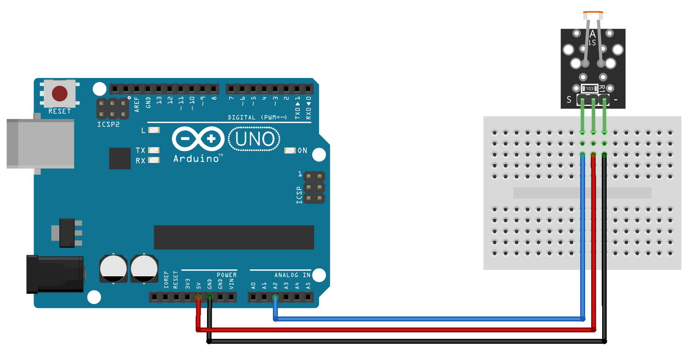
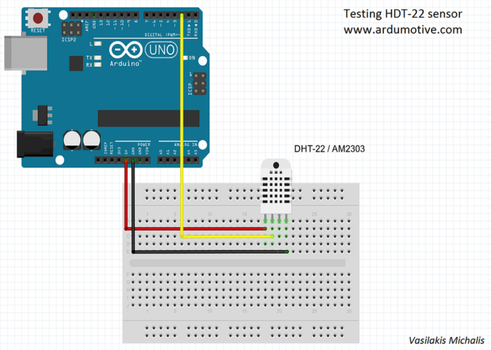

Perfekt – her er et forslag til, hvad **`02-sensor-maaling.md`** skal indeholde, baseret på dine sensorer (DHT22, LDR, gas):

---

### 📘 `02-sensor-maaling.md` – Sensorer og målinger med ESP32 (MicroPython)

#### 🎯 Læringsmål

* Tilslutte og læse data fra 3 forskellige sensortyper
* Bruge `machine.Pin` og `ADC` (analog læsning)
* Installere DHT22-driver og bruge `dht`-modulet

---

### 🧪 Sensorer og deres signaltype

| Sensor     | Type    | Signalledning      | Interface   |
| ---------- | ------- | ------------------ | ----------- |
| **DHT22**  | Digital | 1 pin (data)       | `dht` modul |
| **LDR**    | Analog  | Serie med modstand | `ADC`       |
| **MQ-gas** | Analog  | Direkte til GPIO   | `ADC`       |

---

### 🧰 Forberedelse

* Brug 3.3V (IKKE 5V) til sensorer
* Brug `GND` og `GPIO34`, `GPIO35` eller `GPIO32` som analoge pins
* DHT22 skal tilsluttes med modstand (f.eks. 4.7k) mellem VCC og data

---

### 🧪 Eksempel 1 – Læsning fra LDR (analog)



```python
from machine import ADC, Pin
from time import sleep

ldr = ADC(Pin(34))  # LDR til GPIO34
ldr.atten(ADC.ATTN_11DB)  # spændingsområde 0–3.3V

while True:
    lux = ldr.read()
    print("LDR:", lux)
    sleep(1)
```

---

### 🧪 Eksempel 2 – Læsning fra MQ-gas sensor (analog)

```python
gas = ADC(Pin(35))  # MQ til GPIO35
gas.atten(ADC.ATTN_11DB)

while True:
    gas_val = gas.read()
    print("Gas:", gas_val)
    sleep(1)
```

---

### 🧪 Eksempel 3 – Læsning fra DHT22 (digital)



```python
import dht
from machine import Pin
from time import sleep

sensor = dht.DHT22(Pin(4))  # DHT-data til GPIO4

while True:
    sensor.measure()
    temp = sensor.temperature()
    hum = sensor.humidity()
    print("Temp:", temp, "°C", "Fugt:", hum, "%")
    sleep(2)
```

---

### ✅ Tjekliste

* [ ] Jeg har læst en analog sensor via `ADC.read()`
* [ ] Jeg har aflæst DHT22 med `temperature()` og `humidity()`
* [ ] Jeg har forstået forskellen på digitale og analoge signaler
* [ ] Jeg har valgt passende GPIO-pins

---

Vil du have, at jeg opretter dette som en ny `.md`-fil med navnet `02-sensor-maaling.md`?
