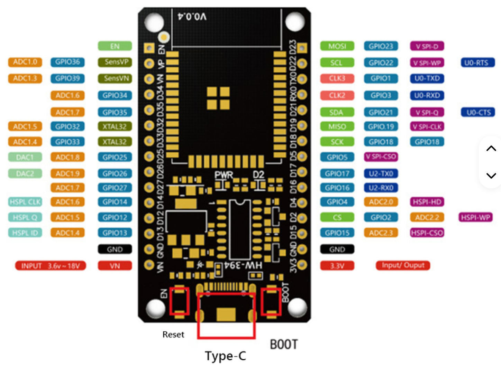

# ESP32 wroom-d laylout


# Hvad kan pins’ene?

## Analoge indgange (ADC)

ESP32 har to ADC’er: **ADC1** og **ADC2**. Når Wi-Fi er aktivt, kan **ADC2 ikke læses stabilt**—brug **ADC1**.

**ADC1 (sikker m. Wi-Fi):**

* GPIO36 (ADC1\_CH0), GPIO37 (CH1), GPIO38 (CH2), GPIO39 (CH3)
* GPIO32 (CH4), GPIO33 (CH5), GPIO34 (CH6), GPIO35 (CH7)

**ADC2 (konflikt med Wi-Fi):**

* GPIO4 (ADC2\_CH0), GPIO0 (CH1), GPIO2 (CH2), GPIO15 (CH3)
* GPIO13 (CH4), GPIO12 (CH5), GPIO14 (CH6), GPIO27 (CH7)
* GPIO25 (CH8), GPIO26 (CH9)

> Tip: brug 11-bit/12-bit opløsning og kalibrering for bedre nøjagtighed.

## Ægte analoge udgange (DAC)

* **GPIO25 = DAC1**
* **GPIO26 = DAC2**

## Digitale I/O

* Næsten alle pins kan bruges digitalt.
* **Input-only:** GPIO34–GPIO39 (kan ikke drive output).
* **Undgå som generelle I/O:** GPIO6–GPIO11 (bundet til eksternt flash på de fleste boards).
* **Strapping/boot-pins (pas på eksterne pull-ups/-downs):** 0, 2, 4, 5, 12, 15.
* **UART0:** GPIO1 (TX0) og GPIO3 (RX0) bruges til programmering/boot-log—kan bruges, men det støjer.

## PWM (LEDC)

ESP32’s PWM-modul (**LEDC**) kan routes til **næsten enhver pin der kan output’e**.
**Må ikke:** GPIO34–39 (input-only) og 6–11 (flash). De fleste andre er fine—undgå dog sensitive boot-pins til kritiske PWM-signaler.

Eksempel (Arduino):

```cpp
const int pwmPin = 18;                  // vælg en “normal” output-pin
ledcSetup(0, 5000, 10);                 // kanal 0, 5 kHz, 10-bit
ledcAttachPin(pwmPin, 0);
ledcWrite(0, 512);                      // ~50% duty
```

## Lille “sikre pins”-huskeliste

* Gode allround I/O/PWM: **13, 14, 18, 19, 21, 22, 23, 25, 26, 27, 32, 33**
* Analoge ind m. Wi-Fi: **32–39** (ADC1)
* Ægte DAC-ud: **25, 26**
* Input-only: **34–39**