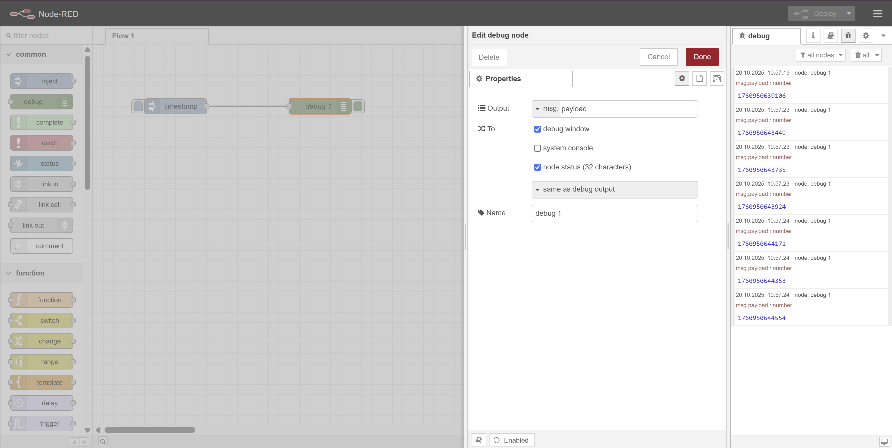
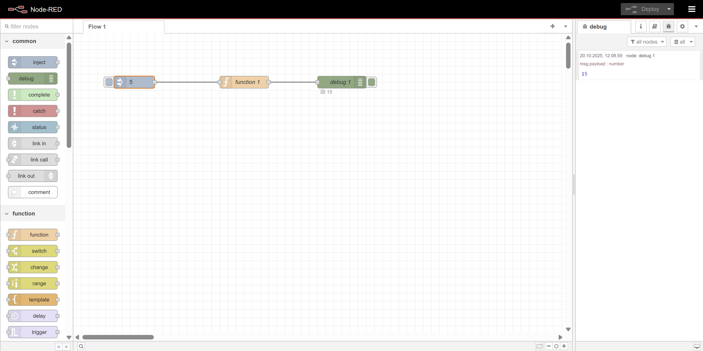
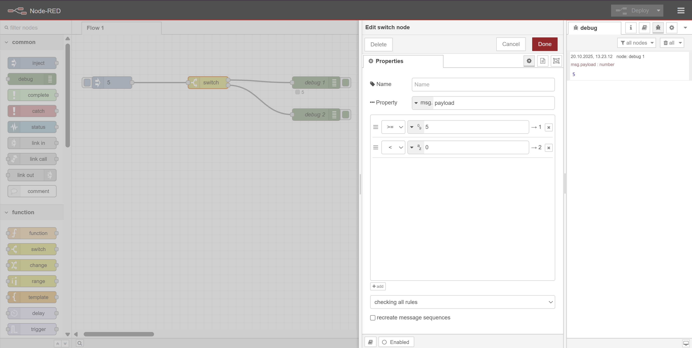
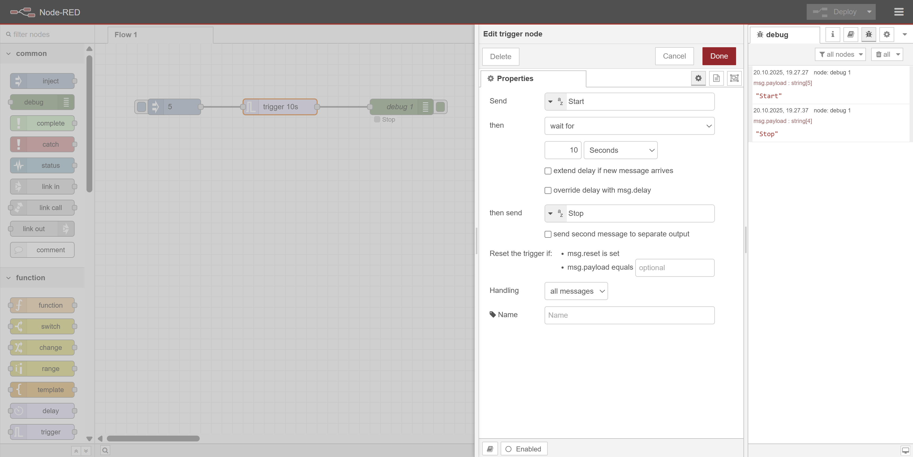

# 🟢 Node-RED: Basale Noder – Opgaver

Her får du en række opgaver, hvor du lærer at bruge de mest grundlæggende noder i Node-RED. Hver node har én eller to små opgaver, så du får hands-on erfaring med deres funktion.

---

## 1️⃣ Inject Node
**Opgave 1:**
- Opret et flow med en Inject-node, der sender en besked (fx "Hello World") til en Debug-node. For at deploy flowet, klik på den røde "Deploy" knap øverst til højre i Node-RED editoren.

**Opgave 2:**
- Skift Inject-node til at sende et tal eller en timestamp. Se resultatet i Debug-vinduet.

---

## 2️⃣ Debug Node
**Opgave 1:**
- Tilføj en Debug-node til et flow og vis output fra en Inject-node under selve noden ved at enable *node-status (32 characters)*.

**Opgave 2:**
- Prøv at ændre Debug-node til kun at vise en specifik del af beskeden (fx msg.topic).
- Hvorfor viser Debug-noden forskellige oplysninger afhængigt af, hvad du vælger? og hvorfor er den tom?

---

## 3️⃣ Function Node
**Opgave 1:**
- Tilføj en Function-node imellem Inject og Debug, der ændrer beskeden til "Du har trykket på knappen!" og send den videre til Debug.

**Hint:** Brug `msg.payload = "Du har trykket på knappen!"` før return msg i function til at ændre beskeden.

**Opgave 2:**
- Lav en Function-node, der lægger 10 til et tal, der kommer fra Inject-node og vis det i Debug.

---

## 4️⃣ Change Node
**Opgave 1:**
- Brug Change-node til at ændre msg.payload fra "Hello" til "Hej med dig" og aflæs i Debug.

**Opgave 2:**
- Brug Change-node til at tilføje et nyt felt til beskeden, fx msg.status = "OK" og aflæs i Debug.

---

## 5️⃣ Switch Node
**Opgave 1:**
- Opret et flow, hvor Switch-node sender beskeder videre til forskellige Debug-noder afhængigt af om tallet er større eller mindre end 5.

**Opgave 2:**
- Udvid med flere betingelser, fx "mindre end 0", "mellem 0 og 5", "større end 5".

---

## 6️⃣ Template Node
**Opgave 1:**
- Brug Template-node til at formatere en besked, fx "Hej {{payload}}!" og vis resultatet i Debug.

---

## 7️⃣ Dashboard Node
**Opgave 1:**
- Installer paletten `node-red-dashboard` via menuen øverst til højre (hamburger-ikonet) → Manage palette → Install → søg efter `node-red-dashboard` og klik Install.

**Opgave 2:**
- Tilføj en Dashboard-node (fx tekst, knap eller graf) og vis data fra Inject eller Function-node.

**Opgave 3:**
- Lav et flow, hvor du kan trykke på en knap i dashboardet og se beskeden i Debug-vinduet.

---

## 8️⃣
**Opgave 1:**
- Indsæt link-in og link-out noder for at forbinde to forskellige noder i dit flow uden at trække ledninger direkte mellem dem.

**Opgave 2:**
- Opret et flow mere så du har to flows. Indsæt Inject-node i flow 1 og sender data til en Link-out node, som så forbindes til en Link-in node i flow 2, der sender data videre til en Debug-node.

---

## 9️⃣
**Opgave 1:**
- Brug en Delay-node til at forsinke beskeder fra en Inject-node med 5 sekunder, før de sendes til en Debug-node.

---

## 🔟
**Opgave 1:**
- Brug en trigger-node til at sende en besked med "Start" ved tryk på en Inject-node, og efter 10 sekunder sende en besked med "Stop" til en Debug-node.

Når du har løst opgaverne, har du fået praktisk erfaring med de mest basale noder i Node-RED!

